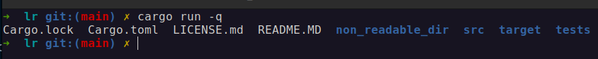
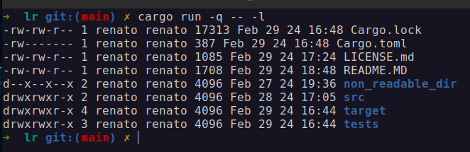

# `lr`
```
 ___            
/\_ \           
\//\ \    _ __  
  \ \ \  /\`'__\
   \_\ \_\ \ \/ 
   /\____\\ \_\ 
   \/____/ \/_/ 

```

Named to reflect its core functionality—listing and reading—`lr` serves as a powerful utility in navigating file systems, providing users with enhanced visibility and control over their directories. Drawing inspiration from the capabilities of traditional Unix commands like `ls`, `lr` is a Rust-based command-line tool designed for blazinly fast file listing and exploration within directories.


## Installation
To install and run `lr` on your system, you will need Rust's package manager, Cargo. If you haven't installed Rust and Cargo, please follow the [official Rust installation guide](https://www.rust-lang.org/tools/install).

Once Rust and Cargo are set up, you can clone the repository and build the project using the following commands:

```
git clone git@github.com:renatodinizc/lr.git
cd lr
cargo build --release
```

The executable will be located in `./target/release/`.

## Flags and Usage Examples

### Arguments

- `[paths]...`: List information about the FILEs (the current directory by default) [default: .]

### Flags

- `-a`, `--all`: Do not ignore entries starting with '.'

- `-l`, `--long`: Use a long listing format

## Example usage





#### Contributing
Contributions to the Grepnir project are welcome! If you're interested in improving the application or adding new features, please consider submitting a pull request. For major changes, please open an issue first to discuss what you would like to change.

Ensure to update tests as appropriate.

### License
This project is licensed under the MIT License - see the [LICENSE](LICENSE.md) file for details.
